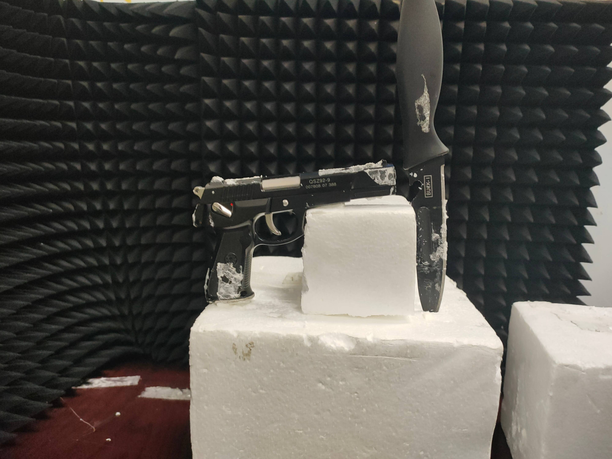
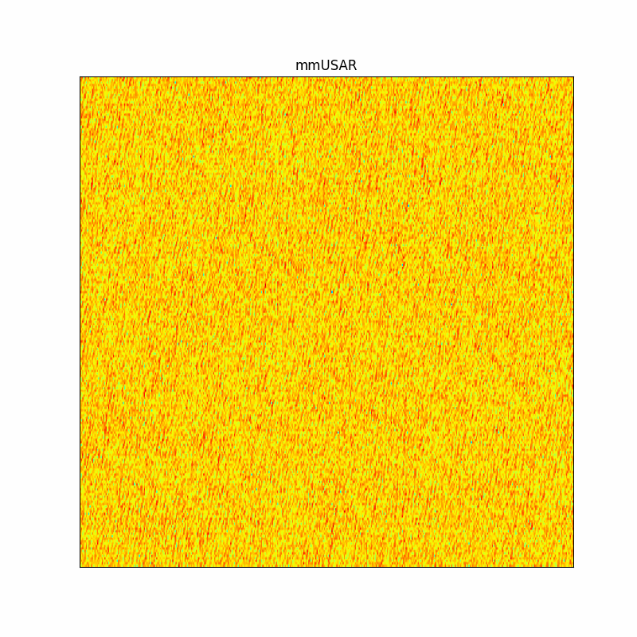
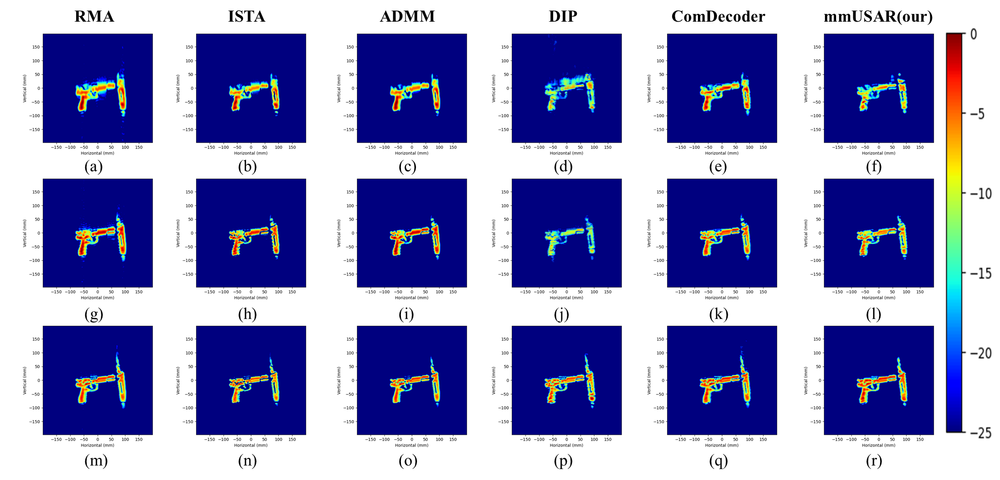

# mmUSAR

The source code for this work will be made open after formal acceptance.

# 🔖 Result Display

---

| **Real Target**  | **mmUSAR Reconstruction Process** |
| :----------------: | :-------------------------------: |
|  |  |

---

---

---

# 🙏 Acknowledgement

[1] [3DRIED Datasets](https://github.com/zzzc1n/3DRIED/tree/main)